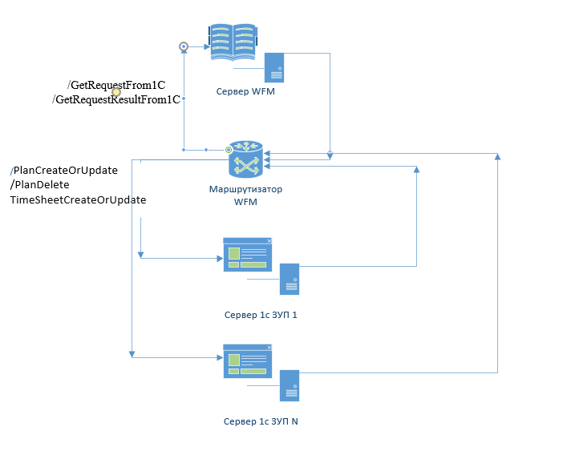
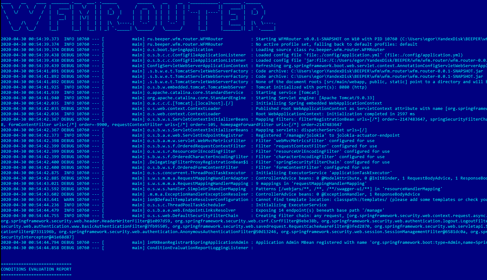
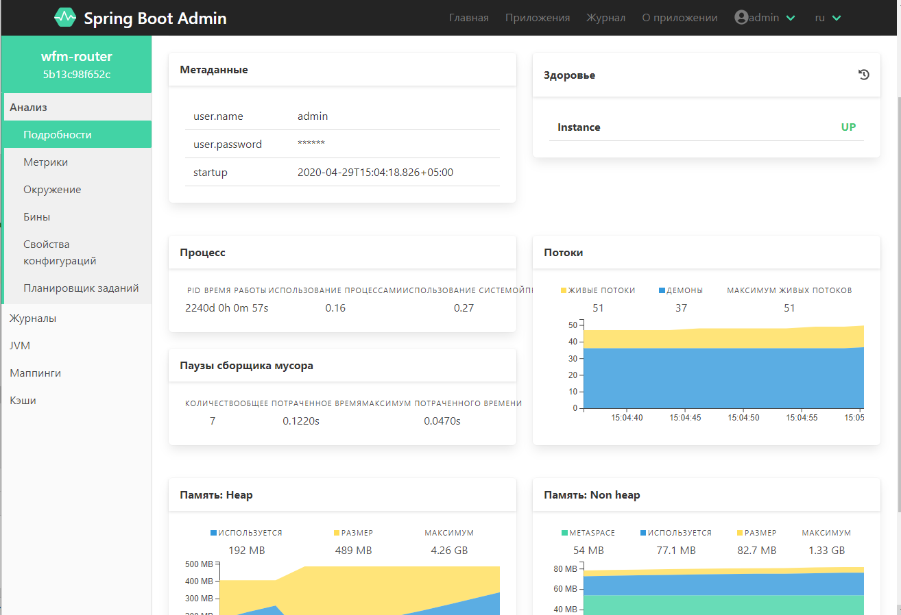
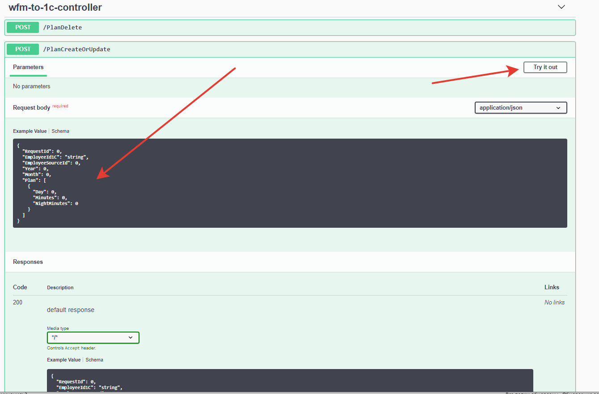

# Проект beeper WFMRouter

## Предназначение

Продукт предназначен для организации маршрутизации выходных и входных http/REST-запросов
между единой WFM и несколькими базами 1с ЗУП.

### Диаграмма взаимодействия


## Описание процессов сборки, конфигурации, запуска и эксплуатации beeper WFMRouter

### Сборка проекта без IDE:

Предварительные условия:
- Перед сборкой проекта на компьютере должна быть установлена JDK 8 (Java SE8) или старше. 
Использование JDK 8 (Java SE8) гарантирует отсутствие проблем.
- Переменная среды JAVA_HOME должна содержать путь к этой JDK, например:
```aidl
set JAVA_HOME="C:\Program Files\Java\jdk1.8.0_241"
```
Но лучше установить эту переменную глобально, для снятия вопросов с windows service. 

В корневой парке проекта запустить команду:
```aidl
mvnw.cmd clean package -DskipTests
```
В проекте для сборки предназначен специальный скрипт, лучше всего использовать его:

build.cmd:
```
call mvnw.cmd clean package -DskipTests
copy /Y target\wfm.router-0.0.1-SNAPSHOT.jar .
```
После сборки в папке "target" относительно корня проекта появится запускаемый файл:
```aidl
wfm.router-0.0.1-SNAPSHOT.jar
```
 ### Запуск и конфигурация WFMRouter
 
 
[Файл конфигурации](config/application.yml) маршрутизатора снабжён подробными комментариями, поэтому его содержимое здесь не описывается.

#### Местоположение файла конфигурации относительно исполняемого файла

- По умолчанию приложение ищет файл конфигурации с названием **application.yml** в папке **config** относительно запускаемого приложения.
- Возможно явное указание местоположения файла конфигурации с помощью ключа 
**"--spring.config.name=conf.yml"**

#### Пример запуска WFMRouter
```
java -jar wfm.router-0.0.1-SNAPSHOT.jar --spring.config.name=wfm.yml
```  
#### Запуск WFMRouter как windows service

В корневой папке проекта имеется файл ```WFMRouter.exe```
Это windows service wrapper. С его помощью можно установить, стартовать, остановить и удалить WFMRouter как сервис windows.
Команды:
```aidl
WFMRouter.exe install
WFMRouter.exe start
WFMRouter.exe stop
WFMRouter.exe uninstall
```
> Примечание. После установки сервиса из этого каталога, каталог удалять **нельзя**!

После запуска WFMRouter как сервиса Windows в корне проекта появятся три лог-файла:
 ```
WFMRouter.err.log  
WFMRouter.out.log  
WFMRouter.wrapper.log
```
Соответственно с логом ошибок, стандартным логом приложения, и логом ошибок враппера windows service.
Начальное содержимое WFMRouter.out.log должно быть примерно таким:


 
### Администрирование

Если зайти браузером на URI по умолчанию, например, так: http://localhost:8080,
после ввода логина и пароля администратора, которые  в данном случае (см. конфигурацию) совпадают с логином и паролем
всех входных endpoints, запустится консоль администратора, на которой можно посмотреть довольно
много информации о состоянии приложения, всех URL, которые оно обслуживает, статусе этих URL и т.д.



### API WFMRouter

API WFMRouter является самодокументированным на основе спецификации OpenAPI (раньше он назывался swagger)

Доступ к браузеру API осуществляется по адресу, например:
```aidl
http://localhost:8080/swagger-ui/index.html
```



> Нажатие на кнопку "Try it out!" позволяет задавать тестовые запросы к API с разными данными.

__TODO__

В настоящий момент API документировано лишь частично. Полная мета-информация к API будет добавлена в ближайшее время.

 ### Интеграционные тесты
 Для прогона [интеграционных тестов](tests/integrationTests.http) использовался mock-сервер Mockoon и стандартные средства Intellij Idea для создания запросов.
 
 ### Нагрузочные тесты
 Для прогона нагрузочных тестов написан python-скрипт, который будет опубликован в ближайшее время в этом репозитории
 
 